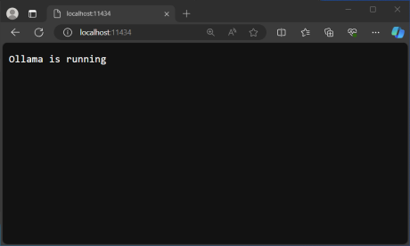
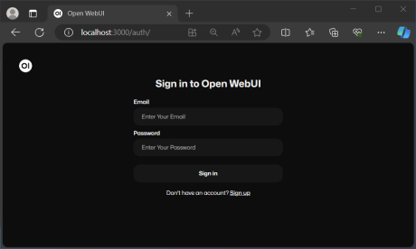
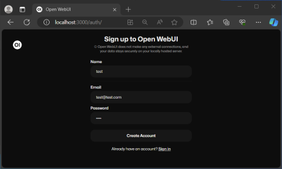
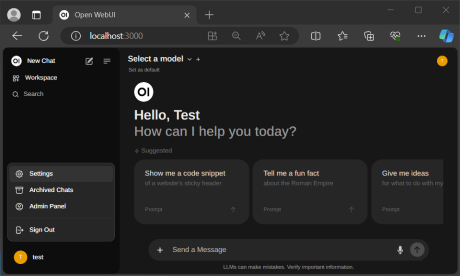
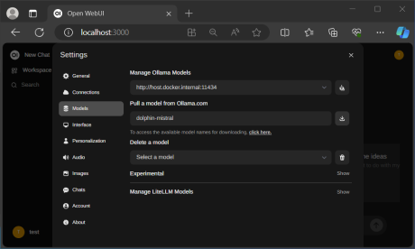
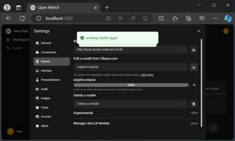
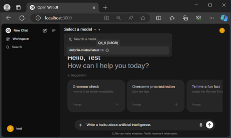
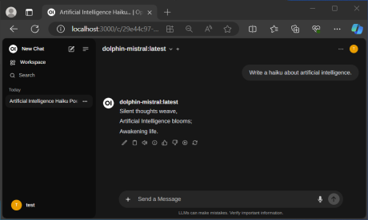

# [atet](https://github.com/atet) / [**_llm_**](https://github.com/atet/llm/blob/main/README.md#atet--llm)

[](#nolink)

# Introduction to Large Language Models

This introduction covers what is absolutely necessary to get you up and running to host _large language models_ like Meta's latest Llama 3 (released April 18, 2024) and other models on your own computer.

--------------------------------------------------------------------------------------------------

## Table of Contents

### Introduction

* [0. Requirements](#0-requirements)
* [1. Examples](#1-examples)
* [2. Installation](#2-installation)
* [3. Next Steps](#3-next-steps)

### Supplemental

* [Other Resources](#other-resources)
* [Troubleshooting](#troubleshooting)
* [Citations](#citations)

--------------------------------------------------------------------------------------------------

## 0. Requirements

The general rules of thumb so that you spend less time troubleshooting and more time ***using these models***:
* Consider how big the models are and use small variants if necessary
* Have more system RAM and GPU VRAM than you think you need
* Load entire model on RAM or VRAM, do not swap!
* If using a GPU, use an Nvidia GPU

The following tutorials will require:

* **Software**: This tutorial was developed on Microsoft Windows 10 with Windows Subsystem for Linux 2 (WSL2) and Docker
* **Hardware**: The size of the large language model you can run is dependent on the amount of...
   * (**CPU-only**) ...system RAM you have, **8 GB RAM is the minimum** for CPU-only processing, but more is welcome
   * (**GPU Acceleration**) ...**Nvidia** GPU VRAM **and** system RAM you have, 4 GB VRAM and 8 GB system RAM is the minimum for GPU processing but more would be better

Minimum Required GPU VRAM / System RAM (GB) | Example Models & Variants | Example Desktop GPU
--- | --- | ---
6 / 12 | • **EleutherAI GPT-Neo** (125 Million → 1.3 Billion Parameter)</br>• **Google FLAN-T5** (Medium → Large)</br>• **Meta AI (Facebook) Fairseq Dense** (125 Million → 1.3 Billion Parameter)</br>• **OpenAI GPT-2** (Small → Extra Large) | Nvidia GeForce GTX 1660
8 / 16 | • **EleutherAI GPT-Neo** (2.7 Billion Parameter)</br>• **Meta AI (Facebook) Fairseq Dense** (2.7 Billion Parameter) | Nvidia GeForce RTX 3050
24 / 48 | • **EleutherAI GPT-J** (6 Billion Parameter)</br>• **Google FLAN-T5** (Extra Large → Extra Extra Large)</br>• **Meta AI (Facebook) Fairseq Dense** (6.7 Billion Parameter) | Nvidia GeForce RTX 3090

NOTE: If you do not have a sufficient GPU but have at least 8 GB of system RAM, you could still try out the smaller GPT-2 models: [Instructions for GPT-2 with system RAM](https://github.com/atet/ggj2022).

[Back to Top](#table-of-contents)

--------------------------------------------------------------------------------------------------

## 1. Examples

The following are actual, real-life responses when leveraging these models for anything from removing writer's block in creative work to summarizing dense text manuscripts to get work done more efficiently.

NOTE: Training, fine-tuning, and prompt engineering are beyond the scope of this tutorial.

### 1.1. Creative Completion of Text

* _From GPT-2 (Small):_

```
input  = "GPT-2 don't be so creepy, you're making me"

output = "GPT-2 don't be so creepy, you're making me cry!"
```

### 1.2. Explanation and Rationale

* _From FLAN-T5 (XL):_

```
input  = "Give the rationale before answering. Could a single human eat an entire elephant in a year?"

output = "An elephant can weigh up to 20,000 pounds. A single human can eat about 2,000 pounds of food in a year. So the final answer is no."
```

### 1.3. Text Summarization

* _From FLAN-T5 (Large):_

```
input  = "Summarize the following for a teenager: HQ USSOCOM is seeking information from qualified sources to understand the capabilities available relevant to Enterprise Data Management, Intelligence, Mission Planning, Command and Control system as part of market research for software-based capabilities. USSOCOM currently has multiple disparate software systems that are utilized to execute a myriad of functions related to mission data, insights, intelligence, planning, and execution. USSOCOM seeks best of breed capabilities for end-to-end solutions to execute these functions while also permitting for the future integration into the greater USSOCOM ecosystem of Software systems for data analytics, intelligence, mission planning, and mission execution. The scope of this effort is for both a readily available end to end system that can be deployed to meet existing in the quickest manner possible while also identifying the best candidate to provide space for modernization with the systems of systems approach USSOCOM is taking. For the purposes of this RFI, the period of performance is assumed to be a 12-month base year starting 1 May 2023 with four 12-month option years."

output = "Read the RFI."
```

### 1.4. Chat Bot

* _From GPT-J (6B):_

```
input  = "Tell me a joke about turtles."

output = "Turtles don't like peanut butter."

input  = "That's not a joke but it did make me laugh."

output = "What do you think about death?"
```

[Back to Top](#table-of-contents)

--------------------------------------------------------------------------------------------------

## 2. Installation

The following instructions will use two Docker images to quickly deploy a browser-based interface that can leverage multiple models appropriate to your available RAM (8 GB system RAM minimum) or VRAM (**Nvidia** GPU with 4 GB VRAM minimum).

NOTE: To take advantage of GPU acceleration in this tutorial, you must have an Nvidia GPU as only Nvidia instructions are provided below

### 2.1. Installing Ollama LLM Server

Pick one of the following methods to install Ollama, CPU-only or GPU accelerated:

<details>
<summary>2.1.1. CPU-only Instructions (<em>click here to expand</em>)</summary>
</br>
&nbsp;&nbsp;&nbsp;&nbsp;2.1.1.1. Start Ollama service from a Docker container:
</br>&nbsp;&nbsp;&nbsp;&nbsp;&nbsp;&nbsp;&nbsp;&nbsp;&nbsp;- NOTE: The command below will not leverage your GPU if you have one that is supported

```console
$ docker run -d -p 11434:11434 -v ollama:/root/.ollama --name ollama --restart always ollama/ollama
```
</details>
</br><b><em>OR</em></b></br></br>
<details>
<summary>2.1.2. GPU Accelerated Instructions (<em>click here to expand</em>)</summary>
</br>
&nbsp;&nbsp;&nbsp;&nbsp;2.1.2.1. Ensure that `nvidia-smi` displays GPU information in commandline:
</br></br>

```console
$ nvidia-smi
Thu May 30 21:12:51 2024
+-----------------------------------------------------------------------------------------+
| NVIDIA-SMI 550.73.01              Driver Version: 552.12         CUDA Version: 12.4     |
|-----------------------------------------+------------------------+----------------------+
| GPU  Name                 Persistence-M | Bus-Id          Disp.A | Volatile Uncorr. ECC |
| Fan  Temp   Perf          Pwr:Usage/Cap |           Memory-Usage | GPU-Util  Compute M. |
|                                         |                        |               MIG M. |
|=========================================+========================+======================|
|   0  NVIDIA GeForce GTX 1650        On  |   00000000:01:00.0 Off |                  N/A |
| N/A   48C    P8              1W /   50W |       1MiB /   4096MiB |      0%      Default |
|                                         |                        |                  N/A |
+-----------------------------------------+------------------------+----------------------+
```

If you do not see the above, in your WSL2 environment, install the most recent Nvidia drivers for your GPU in Windows (not through WSL2): https://www.nvidia.com/download/index.aspx

> NOTE: "_Once a Windows NVIDIA GPU driver is installed on the system, CUDA becomes available within WSL 2...therefore users must not install any NVIDIA GPU Linux driver within WSL 2._" -[Nvidia CUDA on WSL2 User Guide](https://docs.nvidia.com/cuda/wsl-user-guide/index.html#cuda-support-for-wsl-2)

After installation of the GPU drivers, the `nvidia-smi` command should now work within your WSL2 terminal

&nbsp;&nbsp;&nbsp;&nbsp;2.1.2.2. Install the Nvidia Container Toolkit:

```console
$ curl -fsSL https://nvidia.github.io/libnvidia-container/gpgkey | sudo gpg --dearmor -o /usr/share/keyrings/nvidia-container-toolkit-keyring.gpg \
  && curl -s -L https://nvidia.github.io/libnvidia-container/stable/deb/nvidia-container-toolkit.list | \
    sed 's#deb https://#deb [signed-by=/usr/share/keyrings/nvidia-container-toolkit-keyring.gpg] https://#g' | \
    sudo tee /etc/apt/sources.list.d/nvidia-container-toolkit.list
$ sudo apt update && sudo apt -y upgrade
$ sudo apt install -y nvidia-container-toolkit
$ sudo nvidia-ctk runtime configure --runtime=docker
```

&nbsp;&nbsp;&nbsp;&nbsp;2.1.2.3. **You must now restart Docker in WSL2 for the Nvidia configuration to take effect, the easiest way is to restart your computer**

&nbsp;&nbsp;&nbsp;&nbsp;2.1.2.4. Start Ollama service from a Docker container with Nvidia GPU support:
</br>&nbsp;&nbsp;&nbsp;&nbsp;&nbsp;&nbsp;&nbsp;&nbsp;&nbsp;- NOTE: The command below will will only work if your Nvidia GPU is correctly configured for Docker above

```console
$ docker run -d -p 11434:11434 --gpus=all -v ollama:/root/.ollama --name ollama --restart always ollama/ollama
```
</details>
</br>

2.1.3. Confirm Ollama webserver is running by visiting `localhost:11434` and seeing that "`Ollama is running`":
   - NOTE: Do not download any models for Ollama through CLI, they will not register with Open WebUI; we will download models through Open WebUI instead

[](#nolink)

### 2.2. Installing Open WebUI Browser-Based Interface

2.2.1. Start [Open WebUI](https://docs.openwebui.com/getting-started/#installation-with-default-configuration) from a Docker container (this will take a few minutes):

```console
$ docker run -d -p 3000:8080 --add-host=host.docker.internal:host-gateway -v open-webui:/app/backend/data --name open-webui --restart always ghcr.io/open-webui/open-webui:main
```

2.2.2. Access Open WebUI website by visiting `localhost:3000`:

[](#nolink)

2.2.3. Click on "Sign up" at the bottom and register with any username/email (can be fake)/password, and click "Create Account":

[](#nolink)

2.2.4. Click on bottom right icon and select "Settings":

[](#nolink)

2.2.5. Click on "Models" and in the text box for "Pull a model from Ollama.com," type in an appropriate model from the table below, and click on the download icon to the right:

Model | Memory Usage Minimum (System RAM or GPU VRAM)
--- | ---
`llama3:8b-instruct-q3_K_S` | At least 4 GB
`dolphin-mistral:7b` | >4 GB but less than 8 GB
`llama3:8b` | >4 GB but less than 8 GB
`dolphin-mistral:7b-v2.8-fp16` | At least 16 GB
`llama3:8b-instruct-fp16` | >16 GB but less than 20 GB
**More models at:** [ollama.com/library](https://ollama.com/library)

[](#nolink)

2.2.6. Wait for the model to download, have its integrity checked, and properly registered into your Open WebUI environment:

[](#nolink)

2.2.7. Exit from Settings and by default you will be in a "New Chat," click on the top "Select a model," choose a model, and input a prompt at the bottom like, "`Write a haiku about artificial intelligence.`":

[](#nolink)

2.2.8. Depending on CPU (slow) or GPU (fast) processing, it may take a minute to respond:

[](#nolink)

> Silent thoughts weave,
>
> Artificial Intelligence blooms;
>
> Awakening life.
>
> – `dolphin-mistral`

Awesome! Now you've got a powerful large language model **installed locally on your computer**. If you disconnected from the internet, the Open WebUI and dolphin-mistral model would still work!

[Back to Top](#table-of-contents)

--------------------------------------------------------------------------------------------------

## 3. Next Steps

### 3.1. Up-to-Date Models

Keep up to date with the leaderboard of models on Hugging Face at https://huggingface.co/spaces/open-llm-leaderboard/open_llm_leaderboard

NOTE: For Open WebUI with Ollama, available models for Ollama are listed at https://ollama.com/library

### 3.2. Stopping and Uninstalling Open WebUI and Ollama

Good news is that Open WebUI and Ollama were stood up as containers, so nothing was technically "*installed*," you can check the status of the containers, stop, and (re)start them:

```console
$ docker ps -a
CONTAINER ID   IMAGE                                COMMAND               CREATED          STATUS                    PORTS                                           NAMES
f517b5c25628   ghcr.io/open-webui/open-webui:main   "bash start.sh"       47 minutes ago   Up 47 minutes (healthy)   0.0.0.0:3000->8080/tcp, :::3000->8080/tcp       open-webui
d5f7cd566cce   ollama/ollama                        "/bin/ollama serve"   53 minutes ago   Up 53 minutes             0.0.0.0:11434->11434/tcp, :::11434->11434/tcp   ollama

$ docker stop open-webui
open-webui
$ docker stop ollama
ollama

$ docker start open-webui
open-webui
$ docker start ollama
ollama
```

[Back to Top](#table-of-contents)

--------------------------------------------------------------------------------------------------

## Other Resources

Description | Link
--- | ---
What is Windows Subsystem for Linux (WSL)? | https://github.com/atet/wsl
What are large language models (LLMs)? | https://en.wikipedia.org/wiki/Wikipedia:Large_language_models
Nvidia CUDA on WSL2 User Guide | https://docs.nvidia.com/cuda/wsl-user-guide
Open WebUI | https://docs.openwebui.com
Ollama | https://ollama.com
Hugging Face LLM Leaderboard | https://huggingface.co/spaces/open-llm-leaderboard/open_llm_leaderboard

* Expanded table of model hardware requirements:

Model | Size Variant | Required System RAM | Required VRAM | Example Desktop GPU
--- | --- | --- | --- | ---
EleutherAI GPT-Neo | 125 Million Parameter (125M) | 4 GB | 2 GB | Nvidia GeForce GTX 1650
EleutherAI GPT-Neo | 1.3 Billion Parameter (1.3B) | 12 GB | 6 GB | Nvidia GeForce GTX 1660
EleutherAI GPT-Neo | 2.7 Billion Parameter (2.7B) | 16 GB | 8 GB | Nvidia GeForce RTX 3050
EleutherAI GPT-J | 6 Billion Parameter (6B) | 32 GB | 16 GB | Nvidia GeForce RTX 3090
Google FLAN-T5 | Large | 12 GB | 6 GB | Nvidia GeForce GTX 1660
Google FLAN-T5 | Extra Large (XL) | 32 GB | 16 GB | Nvidia GeForce RTX 3090
Google FLAN-T5 | Extra Extra Large (XXL) | 48 GB | 24 GB | Nvidia GeForce RTX 3090
Meta AI (Facebook) Fairseq Dense | 125 Million → 1.3 Billion Parameter (125M, 355M, 1.3B) | 8 GB | 4 GB | Nvidia GeForce GTX 1650
Meta AI (Facebook) Fairseq Dense | 2.7 Billion Parameter (2.7B) | 16 GB | 8 GB | Nvidia GeForce RTX 3050
Meta AI (Facebook) Fairseq Dense | 6.7 Billion Parameter (6.7B) | 32 GB | 16 GB | Nvidia GeForce RTX 3090
OpenAI GPT-2 | Small → Large | 8 GB | 4 GB | Nvidia GeForce GTX 1650
OpenAI GPT-2 | Extra Large (XL) | 12 GB | 6 GB | Nvidia GeForce GTX 1660
OpenAI GPT-3[†](#citations) | 175 Billion Parameter (175B) | 700 GB | 350 GB | ×11 Nvidia Tesla V100 (32GB VRAM)
OpenAI ChatGPT (a.k.a. GPT-3.5)[‡](#citations) | 20 Billion Parameter (20B) | 320 GB | 160 GB | ×5 Nvidia Tesla V100 (32GB VRAM)

[Back to Top](#table-of-contents)

--------------------------------------------------------------------------------------------------

## Troubleshooting

Issue | Solution
--- | ---
I want to access GPT-3 or ChatGPT/GPT-3.5. | You can create an account with OpenAI to access those models online; this tutorial is focused on running the models locally on your computer.
Can I use an AMD or Intel GPU? | No, not for this tutorial.
I don't have enough GPU VRAM. | If you have at least 8 GB of system RAM, you could try out the smaller [GPT-2 models in system RAM](https://github.com/atet/ggj2022).
Model did not seem to install from Ollama in Open WebUI after download completed | Exit out of Settings, go back into Settings/Models and redownload the same model; should start at 100%, reverify, and register correctly
I cannot access `nvidia-smi` within my docker container. | You must install `nvidia-docker2` in addition to docker.
Some LLM responses are very unsettling. | Yes, they are.

[Back to Top](#table-of-contents)

--------------------------------------------------------------------------------------------------

## Citations

† [GPT-3 175B inference requirements](https://bdtechtalks.com/2020/09/21/gpt-3-economy-business-model/#:~:text=According%20to%20the%20OpenAI's%20whitepaper,32%20GB%20of%20memory%20each.)

‡ [Estimated ChatGPT (a.k.a. GPT-3.5) inference requirements](https://twitter.com/tomgoldsteincs/status/1600196981955100694)

[Back to Top](#table-of-contents)

--------------------------------------------------------------------------------------------------

<p align="center">Copyright © 2023-∞ Athit Kao, <a href="http://www.athitkao.com/tos.html" target="_blank">Terms and Conditions</a></p>